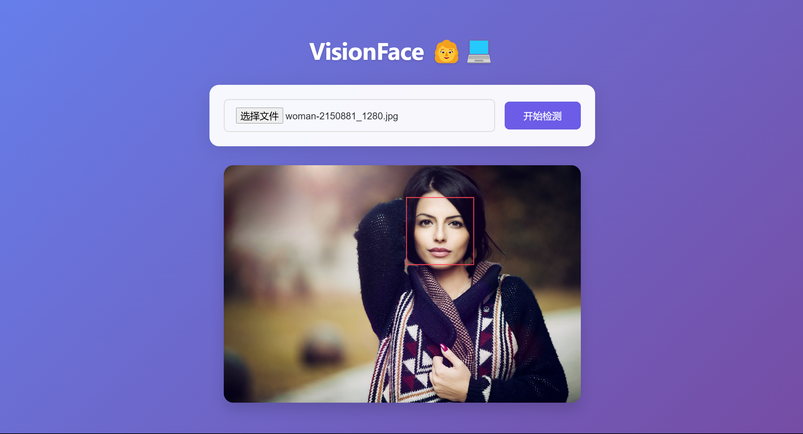

  
一个使用spingboot构建的人脸识别的WEB应用，采用opencv和Javacv进行人脸识别。  
后端Face-detection\src\main\java\com\face\facedetection\FaceDetectionApplication.java即可运行。  
注意的是运行后只能够通过访问8080端口进入，如果使用index.html进入会出现无法检测！！！  
